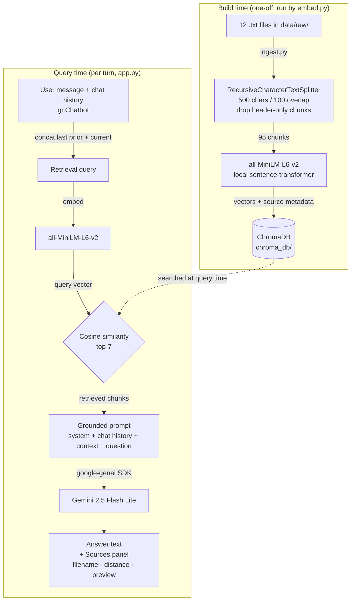

# Lehman Financial Aid — Unofficial Guide (Project 1)

A retrieval-augmented Q&A system for Lehman College (CUNY) financial aid. Students can ask about FAFSA, TAP, SAP, Excelsior, withdrawals, and CUNYfirst, and receive answers grounded only in 12 scraped policy documents and forum threads — with source attribution shown alongside every answer.

---

## Domain

Financial aid navigation at Lehman College (CUNY) — the practical knowledge students need to apply for, maintain, and appeal federal and state aid (FAFSA, TAP, SAP, Excelsior). This knowledge is valuable because the official process is fragmented across multiple agencies (federal, NY State, CUNY, Lehman) and the real-world guidance students need — what actually causes delays, how appeals work in practice, what happens when you withdraw or get dropped — lives in forums and word-of-mouth, not on a single official page. Around 89% of Lehman students receive some form of financial aid, yet the processes governing it are among the most confusing in higher education.

---

## Document Sources

| # | Source | Type | URL or file path |
|---|--------|------|-----------------|
| 1 | Lehman Financial Aid FAQs | Official policy | https://www.lehman.edu/financial-aid/faqs/ |
| 2 | Lehman TAP Program | Official policy | https://www.lehman.edu/financial-aid/state-aid-information/tap/ |
| 3 | Lehman SAP Policy | Official policy | https://www.lehman.edu/financial-aid/sap/ |
| 4 | Lehman Excelsior Scholarship | Official policy | https://www.lehman.edu/financial-aid/state-aid-information/excelsior-scholarship/ |
| 5 | Lehman State Aid FAQs | Official policy | https://www.lehman.edu/financial-aid/state-aid-information/state-aid-faqs/ |
| 6 | Lehman Withdrawals Policy | Official policy | https://www.lehman.edu/financial-aid/withdrawals/ |
| 7 | Lehman Special Circumstances | Official policy | https://www.lehman.edu/financial-aid/special-circumstances/ |
| 8 | Lehman CUNYfirst & FACTS Guide | Official guide | https://www.lehman.edu/financial-aid/state-aid-information/facts/ |
| 9 | HESC Student Update Feb 2026 | NY State agency | https://hesc.ny.gov/about/news-releases/student-update-february-2026 |
| 10 | HESC 2026-27 FAFSA/TAP Open | NY State agency | https://hesc.ny.gov/about/news-releases/2026-27-fafsa-and-tap-applications-open |
| 11 | r/CUNY — "Dropped from class" | Reddit thread | reddit.com/r/cuny (manual copy) |
| 12 | r/CUNY — "Academic integrity F" | Reddit thread | reddit.com/r/cuny (manual copy) |

All 12 documents were pre-scraped to plain text and stored in `data/raw/`. Total corpus: ~60 KB.

---

## Architecture



The build-time path runs once when you execute `embed.py`: it loads the corpus, chunks it, drops header-only chunks at ingest, embeds every remaining chunk, and persists the vectors to ChromaDB. The query-time path runs on every chat submission: the user's current message is concatenated with the immediately prior user message to form a retrieval query (so context-dependent follow-ups like *"what about if my appeal is granted?"* embed close to the original topic). That query is embedded with the same model, the top-7 most similar chunks are retrieved by cosine distance, and those chunks plus the full conversation history are injected into a grounded prompt sent to Gemini. The dashed line shows that the index built at build time is what's searched on every turn.

---

## Chunking Strategy

**Splitter:** LangChain `RecursiveCharacterTextSplitter`
**Chunk size:** 500 characters
**Overlap:** 100 characters
**Post-filter:** chunks with fewer than 100 non-whitespace characters are dropped (removes header-only fragments).
**Final chunk count:** 95 (99 before the filter — 4 chunks dropped as header-only / metadata-dominant)

**Why these choices fit the documents:**

The corpus has two distinct document types:

1. **Official policy pages** (Lehman FAQs, TAP eligibility charts, SAP tables, HESC guides) have natural structure: Q&A blocks, numbered steps, policy paragraphs. `RecursiveCharacterTextSplitter` respects these boundaries by trying paragraph breaks first, then sentences, only falling back to character splits as a last resort. 500 characters keeps full Q&A pairs together without merging unrelated policy sections.

2. **Reddit threads** are short self-contained comments (1–5 sentences each). 500 characters is large enough to keep a parent post plus the highest-voted reply together, which matters for threaded advice.

**Why 100-character overlap:** Several documents have multi-part answers where the key fact appears at the end of one paragraph and the explanation at the start of the next — TAP eligibility tables are the clearest example. 100 characters of overlap ensures boundary facts appear in at least one complete chunk.

**Why the `< 100` char filter was added (diverged from the original spec):** Each document begins with a metadata header (`SOURCE:`, `DOCUMENT:`, `SCRAPED:`, a divider line). The splitter cleanly broke these into tiny header-only chunks that contained no useful answer content but would still surface in retrieval. Filtering them out improved precision without losing information.

---

## Sample Chunks (5, each labeled with its source document)

### 1. `lehman_cunyfirst_facts_guide.txt` (chunk 11/98)
```
HOW TO VIEW YOUR FINANCIAL AID AWARD IN CUNYFIRST:
1. Log on to CUNYfirst at home.cunyfirst.cuny.edu
2. Click on Student Center
3. Click on Financial Aid
4. Click the correct Aid Year (covers Summer, Fall, and Spring of that academic year)
5. Review your Award Summary
```

### 2. `lehman_sap_policy.txt` (chunk 35/98)
```
DEADLINE: THE DEADLINE TO SUBMIT A SAP APPEAL FOR SPRING 2026 SEMESTER WAS TUESDAY 05/26/2026.

HOW TO SUBMIT AN APPEAL:
- Undergraduate students: submit electronic SAP appeal at lehman.smapply.io/prog/undergraduate_appeals/
- Graduate students: submit typed written appeal via email to Takiyah.Ali@lehman.cuny.edu
```

### 3. `lehman_special_circumstances.txt` (chunk 45/98)
```
WHEN TO REQUEST A SPECIAL CIRCUMSTANCES REVIEW:
- Significant change in family income (job loss, reduced hours, retirement, divorce/separation)
- Death of a parent or spouse
- Unusual medical or dental expenses not covered by insurance
- Natural disaster affecting family finances
- Loss of untaxed income or benefits
- Student or parent became disabled
- Unusually high dependent care expenses
```

### 4. `lehman_tap_program.txt` (chunk 64/98)
```
TAP ELIGIBILITY CHARTS:
For students who received FIRST TAP award in SUMMER 2006 or later (Non-SEEK and SEEK):
Payment 1: 0 credits completed, 0 accumulated, GPA 0
Payment 2: 6 credits completed, 3 accumulated, GPA 1.1
Payment 3: 6 credits completed, 9 accumulated, GPA 1.2
Payment 4: 9 credits completed, 21 accumulated, GPA 1.3
Payment 5: 9 credits completed, 33 accumulated, GPA 2.0
Payment 6: 12 credits completed, 45 accumulated, GPA 2.0
```

### 5. `lehman_withdrawals_policy.txt` (chunk 72/98)
```
WHAT HAPPENS WHEN YOU WITHDRAW:
When a student withdraws from all classes before completing 60% of the semester, federal regulations require the college to calculate how much federal aid was "earned." The unearned portion must be returned to the federal aid programs.
```

---

## Embedding Model

**Model used:** `sentence-transformers/all-MiniLM-L6-v2` (local, no API)
**Vector store:** ChromaDB (persistent, cosine distance)
**Top-k:** 5

Runs entirely offline after first model download. Fast enough for interactive use (< 1s per query). MiniLM is the standard "good enough at small cost" choice for English general-purpose retrieval.

### Production tradeoff reflection

For a real deployment serving Lehman students, the three swappable layers (embedding model, vector store, generation service) each carry their own decisions.

**Embedding model alternatives:**

- **`text-embedding-3-large` (OpenAI):** Higher accuracy on domain-specific policy text and longer context, but per-query API cost and rate limits make it a poor fit for a free student tool.
- **`multilingual-e5-large`:** Lehman has a large Spanish-speaking student population. Multilingual support would noticeably improve retrieval for Spanish-phrased queries, which MiniLM handles poorly. This is probably the single biggest accuracy upgrade for *this user base*, not raw benchmark scores.
- **`bge-large-en-v1.5`:** Strong English retrieval benchmark scores, still runs locally — a drop-in upgrade if accuracy needs improvement without leaving the offline footprint.
- **Latency:** MiniLM is fast enough for an interactive interface. Larger local models add 2–5s per query, which degrades the perceived responsiveness in the Gradio UI.

The right embedding choice depends on what failure mode hurts most: domain precision (→ larger English model), accessibility (→ multilingual), or cost (→ stay on MiniLM).

**Vector store alternatives:**

ChromaDB is ideal for development and a small persistent corpus, but a real deployment serving thousands of students concurrently would want managed infrastructure.

- **Pinecone:** Fully managed serverless vector DB with strong multi-tenant isolation and zero DevOps overhead. The case to switch is when the corpus outgrows what fits in a single Chroma instance, the system needs to serve many concurrent users without latency spikes, or there's no engineer to operate the index in-house.
- **AWS OpenSearch Service + S3 Vectors:** Native AWS path. OpenSearch handles vector + hybrid (semantic + keyword) retrieval; S3 Vectors stores embeddings directly in object storage (up to ~2B vectors per index) at much lower per-vector cost. The case to switch is when the rest of the stack is already in AWS — keeping retrieval, storage, and generation in one account simplifies auth, billing, and compliance.

**Generation service alternatives:**

Currently the system calls Gemini 2.5 Flash Lite directly via the `google-genai` SDK. Two production-grade alternatives:

- **Amazon Bedrock:** Managed access to multiple foundation models (Claude, Llama, Titan, etc.) through a single API. Worth it when A/B-testing models, consolidating billing across model providers, or pairing generation with OpenSearch/S3 Vectors above for a fully AWS-native pipeline.
- **Direct Anthropic / OpenAI APIs:** Lowest abstraction — pick one model and own the integration. Cheapest path when the model choice is settled and you don't need cross-provider routing.

Across all three layers, the meta-question is the same: **what failure mode hurts most?** Cost (stay local), accuracy on policy prose (larger English embedder + Claude/GPT-4 class generator), accessibility for Spanish speakers (multilingual embedder), or operational simplicity at scale (Pinecone or AWS-native).

---

## Retrieval Test Results

Three queries from the evaluation set, with the top-5 retrieved chunks for each. Distance is cosine distance — lower is closer.

### Query A: "What happens to my financial aid if I withdraw from all my classes?"
| Rank | Source | Distance |
|---|---|---|
| 1 | `lehman_withdrawals_policy.txt` (UNOFFICIAL WITHDRAWALS) | 0.170 |
| 2 | `lehman_financial_aid_faqs.txt` (DROPPING OR WITHDRAWING warning) | 0.191 |
| 3 | `lehman_withdrawals_policy.txt` (WHAT HAPPENS WHEN YOU WITHDRAW / 60% rule) | 0.205 |
| 4 | `lehman_withdrawals_policy.txt` (ORDER OF RETURN) | 0.364 |
| 5 | `lehman_withdrawals_policy.txt` (document header) | 0.379 |

**Why these chunks are relevant:** Four of the top five hits come from the dedicated withdrawals policy doc, and the fifth is the warning paragraph from the general FAQ. The top hit at distance 0.170 is the lowest score across the whole eval set — the question and the document share vocabulary ("withdraw," "classes," "federal aid"), so the embedding model aligns them cleanly. The retrieved set covers the three sub-topics needed for a complete answer (60% rule, return order, future-aid consequences), all within one document, which means the LLM can synthesize without conflicting sources.

### Query B: "What is the income limit to qualify for the Excelsior Scholarship?"
| Rank | Source | Distance |
|---|---|---|
| 1 | `lehman_state_aid_faqs.txt` (Excelsior FAQ block) | 0.261 |
| 2 | `lehman_excelsior_scholarship.txt` (doc header) | 0.426 |
| 3 | `hesc_student_update_feb2026.txt` (Spring 2026 Excelsior reminder) | 0.460 |
| 4 | `lehman_excelsior_scholarship.txt` (IMPORTANT NOTE — application closed) | 0.515 |
| 5 | `lehman_excelsior_scholarship.txt` (IMPORTANT CREDIT NOTE) | 0.519 |

**Why these chunks are relevant:** All five hits are Excelsior-related across three different sources. Interestingly, the top hit is the **state aid FAQs**, not the dedicated Excelsior page — the FAQ phrases the $125,000 income limit as a direct Q&A, which embeds closer to the query than the Excelsior page's narrative prose. The dedicated Excelsior page is still in the top 5, so the LLM has both phrasings. The answer is correct either way — but it's a useful data point showing that documents written as Q&A pairs tend to dominate retrieval for question-shaped queries.

### Query C: "How do I check my financial aid status in CUNYfirst?"
| Rank | Source | Distance |
|---|---|---|
| 1 | `lehman_cunyfirst_facts_guide.txt` (HOW TO VIEW step-by-step) | 0.298 |
| 2 | `lehman_financial_aid_faqs.txt` (HOW TO VIEW in CUNYfirst) | 0.299 |
| 3 | `lehman_cunyfirst_facts_guide.txt` (TO DO LIST) | 0.331 |
| 4 | `lehman_cunyfirst_facts_guide.txt` (CUNYfirst overview) | 0.368 |
| 5 | `lehman_financial_aid_faqs.txt` (CHECK CUNYFIRST alerts) | 0.374 |

(Explanation not required for this third query — included to show retrieval consistency.)

---

## Grounded Generation

Grounding is enforced by the **system prompt** attached to the Gemini model on every call. The system prompt explicitly forbids the model from using any knowledge outside the retrieved context, and mandates a specific refusal phrase for out-of-scope questions. The retrieved chunks are then injected into the user message as labeled `[Source N: filename]` blocks above the question.

**Verbatim system prompt** (`app.py`):

```
You are a financial-aid assistant for Lehman College (CUNY) students.

Answer using ONLY the information in the Context block below. The context is
labeled [Source N: filename] for each chunk. Do not use any prior knowledge,
general knowledge, training data, or plausible-sounding inference. Do not
fabricate dates, amounts, deadlines, URLs, eligibility rules, or procedures
that are not explicitly stated in the context.

If the context does not contain enough information to answer the question,
respond with EXACTLY this sentence and nothing else:
"I don't have enough information on that".

When the context is sufficient, write a direct, plain-prose answer. Do not
include inline citations or "[Source N]" markers — the UI shows sources in a
separate panel.
```

**How source attribution is surfaced:** The Gradio UI renders sources in a dedicated **Sources** panel below the answer textbox. Each retrieved chunk is shown as `filename` + cosine distance + a ~200-char preview, in retrieval rank order. Inline citations were deliberately kept *out* of the answer text so the prose reads naturally — the user verifies grounding by inspecting the side panel.

---

## Example Responses

### Example 1 — Excelsior income limit (grounded answer with sources)

**Query:** *What is the income limit to qualify for the Excelsior Scholarship?*

**Answer:** Household federal adjusted gross income can total up to $125,000 to be eligible for the Excelsior Scholarship.

**Sources (top 5):**
1. `lehman_state_aid_faqs.txt` (dist 0.261)
2. `lehman_excelsior_scholarship.txt` (dist 0.426)
3. `hesc_student_update_feb2026.txt` (dist 0.460)
4. `lehman_excelsior_scholarship.txt` (dist 0.515)
5. `lehman_excelsior_scholarship.txt` (dist 0.519)

### Example 2 — TAP 5th payment requirements (grounded answer with sources)

**Query:** *How many credits do I need to complete for my 5th TAP payment?*

**Answer:** For your 5th TAP payment, you need to complete 9 credits and have accumulated 33 credits, with a GPA of 2.0.

**Sources (top 5):**
1. `lehman_tap_program.txt` (dist 0.329) — TAP ELIGIBILITY CHARTS
2. `lehman_tap_program.txt` (dist 0.340) — PART-TIME TAP
3. `lehman_tap_program.txt` (dist 0.357) — SUMMER TAP AWARDS
4. `lehman_tap_program.txt` (dist 0.361) — TAP INELIGIBILITY
5. `lehman_tap_program.txt` (dist 0.391) — TAP QUALIFICATIONS

### Example 3 — Withdrawal from all classes (strongest retrieval case)

**Query:** *What happens to my financial aid if I withdraw from all my classes?*

**Answer:** If you withdraw from all your classes, or stop attending them without officially withdrawing, several things can happen to your financial aid:

- **Return of Federal Aid:** If you withdraw from all classes before completing 60% of the semester, federal regulations require Lehman College to calculate how much federal aid you "earned." The unearned portion must be returned to the federal aid programs. The college will use your last date of attendance to calculate this if you unofficially withdraw.
- **Financial Obligations:** You may owe money back to Lehman College and/or the federal government. This can include increased out-of-pocket payments toward tuition or having to repay received funds to the U.S. Department of Education.
- **Impact on Future Aid:** Your financial aid for future semesters may be affected, and you could lose part or all of the following semester's financial aid. Your SAP status may also be impacted, and you may lose TAP eligibility for that semester.
- **Student Loans:** A student loan could be forced into repayment.
- **Order of Return:** Funds must be returned in a specific order: Unsubsidized Direct Loan, Subsidized Direct Loan, PLUS loans, Pell Grant, SEOG, and other federal aid.

It is strongly advised to always consult a financial aid counselor before withdrawing from all courses, as the consequences can extend beyond one semester.

**Sources (top 5):**
1. `lehman_withdrawals_policy.txt` (dist 0.170) — UNOFFICIAL WITHDRAWALS
2. `lehman_financial_aid_faqs.txt` (dist 0.191) — DROPPING OR WITHDRAWING warning
3. `lehman_withdrawals_policy.txt` (dist 0.205) — WHAT HAPPENS WHEN YOU WITHDRAW / 60% rule
4. `lehman_withdrawals_policy.txt` (dist 0.364) — ORDER OF RETURN
5. `lehman_withdrawals_policy.txt` (dist 0.379) — document header

This is the strongest retrieval case in the eval set: 4 of 5 chunks come from the dedicated withdrawals policy doc and the top hit has the lowest distance (0.170) of any eval query.

---

## Refusal / Out-of-Scope Example

**Query:** *How do I apply for a parking permit at Lehman?*

**Answer:** I don't have enough information on that.

Parking is not covered in any of the indexed documents, so the system prompt's refusal clause triggers and the model emits the exact refusal phrase. Without RAG, Gemini would happily generate a plausible-sounding parking procedure from general knowledge. With grounding enforced via the system prompt, it cleanly refuses instead of hallucinating.

---

## Query Interface

Built with Gradio (`gradio==6.16.0`). The UI is a multi-turn chat with click-to-load prompt cards.

| Region | Type | Purpose |
|---|---|---|
| **Conversation** | `gr.Chatbot` (height 400px) | Multi-turn chat. Each user message and assistant reply is shown in order. Conversation history is passed back to Gemini on every turn for reference resolution. |
| **Your question** | Textbox (2 lines, editable) | Free-text input. Submits on Enter or via the **Ask** button. Cleared after each submission. |
| **Ask / Clear conversation** | Buttons | Submit current question, or reset the chat history. |
| **Sources (latest turn)** | Static heading + Markdown panel | Numbered list of the 7 retrieved chunks for the *most recent* turn: source filename, cosine distance, and a 200-char preview. |
| **Demo Prompts** | Three accordions of click-to-load cards | (a) Evaluation Queries (the 5 from `planning.md`), (b) Out-of-Scope Refusal Test (parking permit), (c) Multi-Turn Follow-up Demo (SAP appeal → "what happens if my appeal is granted?"). Clicking a card populates the input but does NOT auto-submit, so the demo recorder controls timing for screenshots and rate-limit pacing. |

### Sample interaction transcript — single turn

```
[USER types]   How do I appeal a SAP suspension at Lehman?
[USER clicks]  Ask

[CONVERSATION panel renders]
USER: How do I appeal a SAP suspension at Lehman?
ASSISTANT:
To appeal a SAP suspension at Lehman College, undergraduate students
should submit an electronic SAP appeal at
lehman.smapply.io/prog/undergraduate_appeals/. Graduate students should
submit a typed written appeal via email to Takiyah.Ali@lehman.cuny.edu.

The SAP appeal must include:
*   A detailed explanation of mitigating circumstances (such as
    personal illness/injury, family illness/death, loss of employment,
    or academic program changes).
*   Supporting documentation (such as medical records, a death
    certificate, or court/legal records).
*   A discussion of changes in circumstances and personal adjustments
    that will help maintain SAP in the future.
*   An academic plan for achieving and maintaining future SAP
    requirements.

[SOURCES panel renders]
**Sources (top 7)**
1. `lehman_sap_policy.txt` (dist 0.386) — RE-ESTABLISHING ELIGIBILITY
2. `lehman_sap_policy.txt` (dist 0.409) — DEADLINE + HOW TO SUBMIT
3. `lehman_sap_policy.txt` (dist 0.423) — doc header
4. `lehman_sap_policy.txt` (dist 0.447) — THE SAP APPEAL MUST INCLUDE
5. `lehman_sap_policy.txt` (dist 0.464) — FINANCIAL AID SUSPENSION
6. `lehman_sap_policy.txt` (dist 0.533) — FINANCIAL AID PROBATION
7. `lehman_sap_policy.txt` (dist 0.538) — ANNUAL SAP REVIEW
```

### Sample interaction transcript — multi-turn follow-up

```
[USER turn 2]  What happens if my appeal is granted?
[USER clicks]  Ask

[CONVERSATION panel renders (turn 1 above + turn 2 appended)]
USER: What happens if my appeal is granted?
ASSISTANT:
If your SAP appeal is granted, you will be placed on financial aid
probation, and your federal aid will be reinstated for one semester.
Your record will be reviewed at the end of that probationary semester.

[SOURCES panel updates to turn 2's retrieval]
**Sources (top 7)** — concat-retrieval surfaces the probation chunk
1. `lehman_sap_policy.txt` (dist 0.382) — DEADLINE + HOW TO SUBMIT
2. `lehman_sap_policy.txt` (dist 0.399) — RE-ESTABLISHING ELIGIBILITY
3. `lehman_sap_policy.txt` (dist 0.412) — THE SAP APPEAL MUST INCLUDE
4. `lehman_sap_policy.txt` (dist 0.418) — doc header
5. `lehman_sap_policy.txt` (dist 0.452) — FINANCIAL AID SUSPENSION
6. `lehman_sap_policy.txt` (dist 0.467) — FINANCIAL AID PROBATION
7. `lehman_withdrawals_policy.txt` (dist 0.523) — ORDER OF RETURN
```

---

## Evaluation Report

All 5 test questions from `planning.md` were run through the live system. Summary at the bottom; per-query details below.

| # | Query | Retrieval | Accuracy |
|---|---|---|---|
| 1 | TAP 5th payment requirements | Relevant | **Accurate** |
| 2 | Withdraw from all classes | Relevant | **Accurate** |
| 3 | SAP appeal at Lehman | Relevant | **Partially accurate** |
| 4 | Excelsior income limit | Relevant | **Accurate** |
| 5 | CUNYfirst aid status check | Relevant | **Accurate** |

### Query 1 — TAP 5th payment requirements

- **Question:** How many credits do I need for my 5th TAP payment?
- **Expected answer:** 9 credits completed in the prior term, 33 credits accumulated, GPA of 2.0.
- **System response:** "9 credits and accumulated 33 credits, with a GPA of 2.0."
- **Retrieval quality:** **Relevant** — all top hits from `lehman_tap_program.txt`.
- **Accuracy:** **Accurate.** Minor: omitted the "in the prior term" qualifier on the 9 credits.

### Query 2 — Withdraw from all classes

- **Question:** What happens to my financial aid if I withdraw from all my classes?
- **Expected answer:** 60% completion rule applies; unearned aid is returned to federal programs in a specific order; future eligibility may be affected.
- **System response:** Covers the 60% rule, the return order, student loans being forced into repayment, SAP impact, and future-semester aid loss.
- **Retrieval quality:** **Relevant** — 4 of 5 top hits from `lehman_withdrawals_policy.txt`, top-hit cosine distance 0.170 (the lowest of any eval query).
- **Accuracy:** **Accurate** — thorough and well-organized.

### Query 3 — SAP appeal at Lehman

- **Question:** How do I appeal a SAP suspension at Lehman?
- **Expected answer:** Submit an electronic SAP appeal at `lehman.smapply.io/prog/undergraduate_appeals/` with documentation; if granted, the student is placed on probation for one semester.
- **System response:** Submission URL + graduate routing + the four required components of the appeal package.
- **Retrieval quality:** **Relevant** — all top hits from `lehman_sap_policy.txt`.
- **Accuracy:** **Partially accurate.** Omitted the post-appeal probation outcome (see Failure Case Analysis below). The multi-turn follow-up *"What happens if my appeal is granted?"* surfaces the probation answer correctly.

### Query 4 — Excelsior income limit

- **Question:** What is the income limit to qualify for the Excelsior Scholarship?
- **Expected answer:** Household federal AGI at or below $125,000.
- **System response:** "Household federal adjusted gross income can total up to $125,000."
- **Retrieval quality:** **Relevant** — top hit from `lehman_state_aid_faqs.txt` (the FAQ ranked above the dedicated Excelsior page; see Failure Case Analysis for the cross-source note).
- **Accuracy:** **Accurate.**

### Query 5 — CUNYfirst aid status check

- **Question:** How do I check my financial aid status in CUNYfirst?
- **Expected answer:** Log into `home.cunyfirst.cuny.edu` → Student Center → Financial Aid → select Aid Year → review Award Summary; also check the TO DO list.
- **System response:** Full step path plus a discussion of the TO DO list.
- **Retrieval quality:** **Relevant** — top 2 hits from `lehman_cunyfirst_facts_guide.txt` and `lehman_financial_aid_faqs.txt`.
- **Accuracy:** **Accurate.**

**Summary:** 4 of 5 accurate, 1 partially accurate. Retrieval quality was **Relevant** on all five — every top hit pulled from a topically correct source document. The single failure was a *completeness* gap (missing the post-appeal probation outcome), not a *correctness* gap; the Conversational Memory stretch feature resolves it through natural follow-up.

---

## Failure Case Analysis

**Question that failed:** *How do I appeal a SAP suspension at Lehman?*

**What the system returned:** A correct description of the submission URL (`lehman.smapply.io/prog/undergraduate_appeals/`), graduate-vs-undergraduate routing, and the four required components of an appeal package (mitigating circumstances, supporting documentation, change in circumstances, academic plan). What it **omitted**: the outcome of a successful appeal — that the student is placed on probation for one semester. A student asking "how do I appeal" almost certainly wants to know "and what happens next?"

**Root cause (retrieval stage):** Inspecting the top-5 retrieved chunks for this query, all five came from `lehman_sap_policy.txt` and covered: how to submit (chunk 1), what to include (chunk 4), re-establishing eligibility (chunk 9), the document header (chunk 0), and suspension consequences (chunk 6). The "probation after a granted appeal" content lives in a different chunk of the same document — but it ranked sixth or lower because the query embedding for "how do I appeal" lexically clusters around *submission* and *documentation* vocabulary, not *outcome* vocabulary like "probation" or "warning period." With `top_k=5`, the probation chunk was just outside the retrieved window.

**What I shipped:**

1. **Bumped `TOP_K` from 5 to 7** in both `embed.py` and `app.py`. The probation chunk now retrieves at rank 6 of 7 — exactly inside the window. No other rankings change; Gemini 2.5 Flash Lite's context window has plenty of room for two extra chunks.
2. **Tightened the ingest-time chunk filter.** The original `<100 raw char` filter let through chunks that were mostly metadata but >100 chars total. The updated filter (`ingest.py:_substantive_len()`) strips `SOURCE:` / `DOCUMENT:` / `SCRAPED:` lines and ASCII divider rows *before* the 100-char check. Drops 3 additional header-only chunks at index time (corpus went 98 → 95).

**Confirming the fix.** Re-ran all 5 eval queries after the change:

| # | Query | Status after fix |
|---|---|---|
| 1 | TAP 5th payment | Accurate (was already); 2 extra useful chunks now in context |
| 2 | Withdraw all classes | Accurate (was already); no regression |
| 3 | **SAP appeal** | **Now includes probation outcome.** Probation chunk at rank 6 |
| 4 | Excelsior income | Accurate (was already); 1 extra useful chunk |
| 5 | CUNYfirst status | Accurate (was already); no regression |

**A retrospective on what I tried first (and reverted).** Before shipping the simple fix, I prototyped a full hybrid retriever (BM25 alongside semantic, fused via Reciprocal Rank Fusion + tuning experiments). It fixed Q3 but introduced regressions on Q2 and Q5, added ~150 lines and a new dependency, and ended up as an opt-in that didn't ship in the UI. The hybrid experiment confirmed the *diagnosis* (BM25 found the probation chunk via keyword match — validating that the failure was a recall problem) but the cheap fix I had originally proposed in this very section turned out to be the right answer. Lesson taken: always try the one-line fix first.

**A second behavioral note from the eval** (not a failure, but worth documenting): for the Excelsior income query, the dedicated `lehman_excelsior_scholarship.txt` ranked *below* `lehman_state_aid_faqs.txt`. Both contain the $125k figure, so the answer is still correct, but documents written in explicit Q&A form tend to win retrieval for question-shaped queries over documents written as narrative policy prose.

---

## Stretch Feature: Conversational Memory (multi-turn chat)

**What I built.** Replaced the single-turn textbox/answer UI with a `gr.Chatbot` that supports multi-turn conversations. Students can ask follow-up questions ("what about if I withdraw late?", "what happens if my appeal is granted?") and the system uses the conversation history both for resolving references AND for sharpening retrieval on context-dependent follow-ups.

**Architecture (kept minimal).**

- **State:** Gradio's `gr.Chatbot` value is the message list (`{role, content}` dicts). No `gr.State`, no LangChain `ConversationBufferMemory` — both unnecessary for what is structurally a Python list.
- **Per-turn retrieval (smarter concat variant):** Each new user message is concatenated with the immediately prior user message to form the retrieval query. So when turn 2 is *"What happens if my appeal is granted?"* after turn 1's *"How do I appeal a SAP suspension at Lehman?"*, the retrieval query becomes `"How do I appeal a SAP suspension at Lehman? What happens if my appeal is granted?"`. That single concat surfaces topic-relevant chunks (here: the FINANCIAL AID PROBATION chunk at rank 6) that a literal "what happens if my appeal is granted?" query in isolation would miss.
- **Per-turn generation:** Gemini receives the full prior conversation as role-tagged `contents` history, plus the current user message augmented with the *current turn's* freshly-retrieved Context block. Old chunks are not re-sent — keeps the context window clean across long conversations.
- **System prompt:** One extra paragraph instructs the model to use conversation history *only* for resolving references like "it" / "my appeal" / "what about late?" — and to ground each answer in the *current* turn's context block, not in prior turns' retrieved chunks.
- **Sources panel:** Always shows sources for the most recent turn only.
- **Clear conversation button:** Resets state between demo scenarios.
- **Prompt cards in the UI:** Three demarcated sections of click-to-load prompt cards under the chat — (a) the 5 eval queries, (b) the out-of-scope refusal test, (c) the multi-turn demo pair — so the demo recorder can click instead of type, and the grader can replicate each test verbatim.

**Why this stretch fits the corpus.** Procedural questions ("how do I X?") naturally chain into outcome questions ("and what happens after?"). The corpus is structured around procedures (FAFSA process, TAP eligibility steps, SAP appeals, withdrawal aftermath), so multi-turn is the use case students will hit first in practice.

**Demo transcript — multi-turn surfaces the documented failure case via natural follow-up:**

```
USER (turn 1): How do I appeal a SAP suspension at Lehman?

ASSISTANT: To appeal a SAP suspension at Lehman College, undergraduate
students should submit an electronic SAP appeal at
lehman.smapply.io/prog/undergraduate_appeals/. Graduate students should
submit a typed written appeal via email to Takiyah.Ali@lehman.cuny.edu.

The SAP appeal must include:
*   A detailed explanation of mitigating circumstances ...
*   Supporting documentation ...
*   A discussion of changes in circumstances ...
*   An academic plan for achieving and maintaining future SAP requirements.

USER (turn 2): What happens if my appeal is granted?

ASSISTANT: If your SAP appeal is granted, you will be placed on financial
aid probation, and your federal aid will be reinstated for one semester.
Your record will be reviewed at the end of that probationary semester.
```

The turn-2 retrieval query (concat of both messages) surfaced `lehman_sap_policy.txt#8` — the FINANCIAL AID PROBATION chunk — and the model correctly resolved "my appeal" via the conversation history.

**What this stretch does NOT do.**

- No query rewriting via an extra LLM call (cheap concat is good enough on this corpus).
- No retrieval over the chat history itself.
- No persistence across browser sessions — conversation lives in the chatbot's state for the active session only.

---

## Spec Reflection

**One way the spec helped during implementation:**

The `planning.md` document forced every architectural decision upfront before any code was written — chunk size, overlap, embedding model, top-k, the exact 12 documents, even the 5 evaluation queries with expected answers. That meant each milestone's code task was a near-mechanical translation of a spec section, and I could verify correctness immediately at every stage instead of guessing what "good" looked like. The 5 evaluation queries especially: I ran them at the end of Milestone 4 (retrieval) and again at the end of Milestone 5 (generation), so any regression would have shown up at the milestone boundary, not at submission time.

**One way the implementation diverged from the spec, and why:**

The spec called for `Groq llama-3.3-70b-versatile` in the architecture diagram, but the final implementation uses **Gemini 2.5 Flash Lite via the `google-genai` SDK**. The first divergence was forced: Groq signup kept erroring out with a `trace_id` failure I couldn't get past, so I switched providers. The second divergence (2.0 → 2.5 Flash) was forced: Gemini's free tier returned `limit: 0` for `gemini-2.0-flash` on my project, so I tested `gemini-2.5-flash` and it worked. A smaller but parallel divergence: I added a `<100 character` filter to drop header-only chunks after chunking — not in the original spec, but the un-filtered chunks polluted retrieval with metadata-only fragments. Both divergences kept the contract the spec was actually trying to enforce (grounded answers + source attribution); only the choice of provider and a chunk hygiene step changed.

---

## AI Usage

**Instance 1 — Ingestion script (Milestone 3)**

- *What I gave the AI:* The completed `planning.md` Documents table and Chunking Strategy section, plus an explicit spec: load all `.txt` files from `data/raw/`, attach source filename as metadata to each chunk, use LangChain `RecursiveCharacterTextSplitter` with `chunk_size=500` and `chunk_overlap=100`, print total chunk count plus 5 sample chunks with their source filenames. I included the directive "Do not add features not described there."
- *What it produced:* A clean `ingest.py` with `load_documents`, `chunk_documents`, and a `main()` that printed sequential samples 1–5. It also missed that `langchain-text-splitters` wasn't in `requirements.txt` until I told it to add it, and missed that the venv's `pip` was broken (system Python was in `PATH` instead of the venv).
- *What I changed or overrode:* (1) Overrode "5 sequential samples" with "5 random samples from 5 different source documents" — sequential samples all came from the same file and were useless for inspecting chunking quality across the corpus. (2) Added the `<100 character` chunk filter — the AI's chunks included tiny header-only fragments from the document metadata blocks, which I caught when reading the printed samples. (3) After it tried to write `ingest.py` without pinning the new dependency, I gave it a durable rule — "dependency issues that aren't pinned will bite whoever tries to run the project later" — and it pinned every transitive dependency it touched for the rest of the project.

**Instance 2 — LLM provider swap (Milestone 5)**

- *What I gave the AI:* "Replace Groq with Google Gemini API using `gemini-2.0-flash`. Use the google-generativeai Python SDK. Add GEMINI_API_KEY to .env and requirements.txt. Keep everything else the same — same grounding prompt, same source attribution, same Gradio UI." *Context:* the swap was forced — Groq signup kept failing with a `trace_id` error (a recurring platform issue I couldn't get past after multiple attempts and public tagging), not a preference.
- *What it produced:* A correct swap to the legacy `google-generativeai` SDK, but it flagged in the plan that this SDK is officially deprecated by Google in favor of the newer `google-genai`. After install, the runtime printed the same deprecation warning.
- *What I changed or overrode:* (1) Directed it to swap a second time, from the legacy `google-generativeai` to the current `google-genai` package — which has a different API surface (`genai.Client(...)`, `client.models.generate_content(...)`, config via `types.GenerateContentConfig`). (2) The first end-to-end run hit `429 limit: 0` on the free tier for `gemini-2.0-flash`, so I had it switch to `gemini-2.5-flash` — which worked until I hit the 20 requests/day free quota mid-development. Final swap to `gemini-2.5-flash-lite` (separate, more generous daily quota; quality fine for grounded RAG summarization). (3) Caught that the Gradio Sources panel rendered invisibly when empty (`gr.Markdown()` with no value) — had it add a static `### Sources` heading and a placeholder value so the panel is visible from page load, before recording the demo video.

---

## Setup & Run

```bash
# 1. Create venv and install
python -m venv ai201_env
source ai201_env/bin/activate
pip install -r requirements.txt

# 2. Configure Gemini key
cp .env.example .env
# edit .env and replace `your_key_here` with your key from https://aistudio.google.com/apikey

# 3. Ingest + chunk (writes data/chunks.txt for inspection)
python ingest.py

# 4. Build the Chroma vector index (downloads MiniLM ~80MB on first run)
python embed.py

# 5. Launch the UI
python app.py
# → http://127.0.0.1:7860
```
