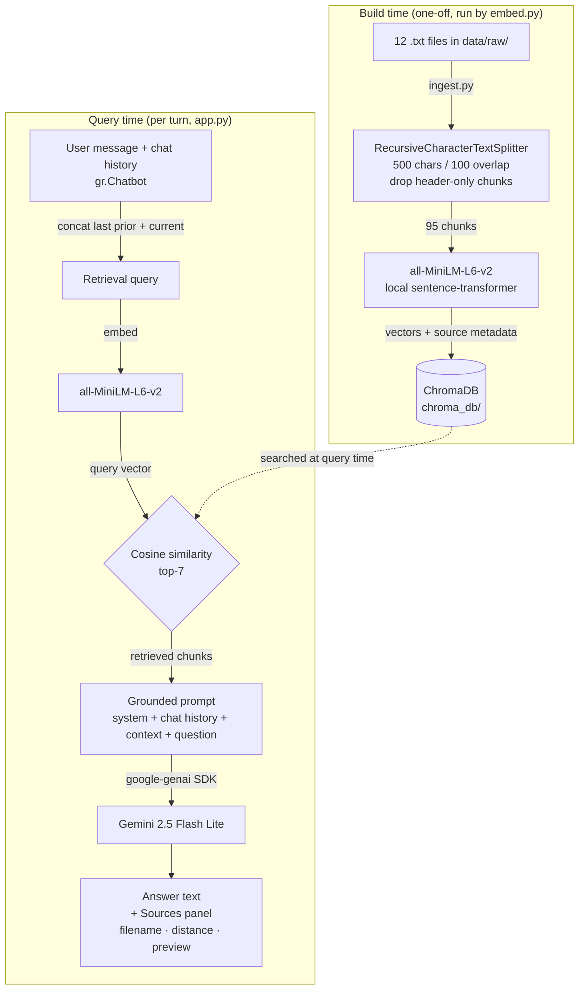

# Lehman Financial Aid — Unofficial Guide (Project 1)

A retrieval-augmented Q&A system for Lehman College (CUNY) financial aid. Students can ask about FAFSA, TAP, SAP, Excelsior, withdrawals, and CUNYfirst, and receive answers grounded only in 12 scraped policy documents and forum threads — with source attribution shown alongside every answer.

---

## Domain

Financial aid navigation at Lehman College (CUNY) — the practical knowledge students need to apply for, maintain, and appeal federal and state aid (FAFSA, TAP, SAP, Excelsior). This knowledge is valuable because the official process is fragmented across multiple agencies (federal, NY State, CUNY, Lehman) and the real-world guidance students need — what actually causes delays, how appeals work in practice, what happens when you withdraw or get dropped — lives in forums and word-of-mouth, not on a single official page. Around 89% of Lehman students receive some form of financial aid, yet the processes governing it are among the most confusing in higher education.

---

## Document Sources

| # | Source | Type | URL or file path |
|---|--------|------|-----------------|
| 1 | Lehman Financial Aid FAQs | Official policy | https://www.lehman.edu/financial-aid/faqs/ |
| 2 | Lehman TAP Program | Official policy | https://www.lehman.edu/financial-aid/state-aid-information/tap/ |
| 3 | Lehman SAP Policy | Official policy | https://www.lehman.edu/financial-aid/sap/ |
| 4 | Lehman Excelsior Scholarship | Official policy | https://www.lehman.edu/financial-aid/state-aid-information/excelsior-scholarship/ |
| 5 | Lehman State Aid FAQs | Official policy | https://www.lehman.edu/financial-aid/state-aid-information/state-aid-faqs/ |
| 6 | Lehman Withdrawals Policy | Official policy | https://www.lehman.edu/financial-aid/withdrawals/ |
| 7 | Lehman Special Circumstances | Official policy | https://www.lehman.edu/financial-aid/special-circumstances/ |
| 8 | Lehman CUNYfirst & FACTS Guide | Official guide | https://www.lehman.edu/financial-aid/state-aid-information/facts/ |
| 9 | HESC Student Update Feb 2026 | NY State agency | https://hesc.ny.gov/about/news-releases/student-update-february-2026 |
| 10 | HESC 2026-27 FAFSA/TAP Open | NY State agency | https://hesc.ny.gov/about/news-releases/2026-27-fafsa-and-tap-applications-open |
| 11 | r/CUNY — "Dropped from class" | Reddit thread | reddit.com/r/cuny (manual copy) |
| 12 | r/CUNY — "Academic integrity F" | Reddit thread | reddit.com/r/cuny (manual copy) |

All 12 documents were pre-scraped to plain text and stored in `data/raw/`. Total corpus: ~60 KB.

---

## Architecture



Build time runs once (`embed.py`); query time runs on every chat submission using the current message concatenated with the prior user message as the retrieval query, so follow-ups like *"what happens if my appeal is granted?"* embed close to the original topic.

- The dashed line shows the build-time index is what's searched on every query-time turn.

---

## Chunking Strategy

**Splitter:** LangChain `RecursiveCharacterTextSplitter`
**Chunk size:** 500 characters
**Overlap:** 100 characters
**Post-filter:** chunks with fewer than 100 non-whitespace characters are dropped (removes header-only fragments).
**Final chunk count:** 95 (99 before the filter — 4 chunks dropped as header-only / metadata-dominant)

**Why these choices fit the documents:**

- **Official policy pages** (FAQs, TAP charts, SAP tables): `RecursiveCharacterTextSplitter` tries paragraph breaks first — 500 chars keeps full Q&A pairs together without merging unrelated sections.
- **Reddit threads**: short self-contained comments (1–5 sentences). 500 chars keeps a parent post and its top reply in one chunk.
- **100-char overlap**: TAP eligibility tables have key facts split across paragraph boundaries — overlap ensures they appear in at least one complete chunk.
- **`< 100` char filter (spec divergence)**: every document begins with a `SOURCE:` / `DOCUMENT:` / `SCRAPED:` header. The splitter isolated these into useless metadata-only chunks that polluted retrieval; filtering them raised precision with zero information loss.

---

## Sample Chunks (5, each labeled with its source document)

### 1. `lehman_cunyfirst_facts_guide.txt` (chunk 11/98)
```
HOW TO VIEW YOUR FINANCIAL AID AWARD IN CUNYFIRST:
1. Log on to CUNYfirst at home.cunyfirst.cuny.edu
2. Click on Student Center
3. Click on Financial Aid
4. Click the correct Aid Year (covers Summer, Fall, and Spring of that academic year)
5. Review your Award Summary
```

### 2. `lehman_sap_policy.txt` (chunk 35/98)
```
DEADLINE: THE DEADLINE TO SUBMIT A SAP APPEAL FOR SPRING 2026 SEMESTER WAS TUESDAY 05/26/2026.

HOW TO SUBMIT AN APPEAL:
- Undergraduate students: submit electronic SAP appeal at lehman.smapply.io/prog/undergraduate_appeals/
- Graduate students: submit typed written appeal via email to Takiyah.Ali@lehman.cuny.edu
```

### 3. `lehman_special_circumstances.txt` (chunk 45/98)
```
WHEN TO REQUEST A SPECIAL CIRCUMSTANCES REVIEW:
- Significant change in family income (job loss, reduced hours, retirement, divorce/separation)
- Death of a parent or spouse
- Unusual medical or dental expenses not covered by insurance
- Natural disaster affecting family finances
- Loss of untaxed income or benefits
- Student or parent became disabled
- Unusually high dependent care expenses
```

### 4. `lehman_tap_program.txt` (chunk 64/98)
```
TAP ELIGIBILITY CHARTS:
For students who received FIRST TAP award in SUMMER 2006 or later (Non-SEEK and SEEK):
Payment 1: 0 credits completed, 0 accumulated, GPA 0
Payment 2: 6 credits completed, 3 accumulated, GPA 1.1
Payment 3: 6 credits completed, 9 accumulated, GPA 1.2
Payment 4: 9 credits completed, 21 accumulated, GPA 1.3
Payment 5: 9 credits completed, 33 accumulated, GPA 2.0
Payment 6: 12 credits completed, 45 accumulated, GPA 2.0
```

### 5. `lehman_withdrawals_policy.txt` (chunk 72/98)
```
WHAT HAPPENS WHEN YOU WITHDRAW:
When a student withdraws from all classes before completing 60% of the semester, federal regulations require the college to calculate how much federal aid was "earned." The unearned portion must be returned to the federal aid programs.
```

---

## Embedding Model

**Model used:** `sentence-transformers/all-MiniLM-L6-v2` (local, no API)
**Vector store:** ChromaDB (persistent, cosine distance)
**Top-k:** 7

### Production tradeoff reflection

**Embedding model alternatives:**
- `multilingual-e5-large` — biggest accuracy gain *for this user base*; Lehman's large Spanish-speaking population gets poor MiniLM retrieval on Spanish-phrased queries.
- `bge-large-en-v1.5` — strongest English retrieval benchmarks, still runs locally; drop-in upgrade if domain accuracy is the priority.
- `text-embedding-3-large` (OpenAI) — highest ceiling, but per-query cost and rate limits are a poor fit for a free student tool.

**Vector store alternatives:**
- **Pinecone** — fully managed, zero DevOps. Switch when the corpus outgrows a single Chroma instance or concurrent-user load demands it.
- **AWS OpenSearch + S3 Vectors** — native AWS path with hybrid (semantic + keyword) retrieval built in; worth it when the rest of the stack is already in AWS.

**Generation service alternatives:**
- **Amazon Bedrock** — multi-model access via one API; useful for A/B testing or a fully AWS-native pipeline.
- **Direct Anthropic / OpenAI APIs** — lowest abstraction; cheapest when the model choice is settled.

Meta-question across all three layers: **what failure mode hurts most?** Cost → stay local. Accuracy on policy prose → larger English embedder + Claude/GPT-4 class generator. Spanish-speaker accessibility → multilingual embedder. Scale → Pinecone or AWS-native.

---

## Retrieval Test Results

Three queries from the evaluation set, with the top-5 retrieved chunks for each. Distance is cosine distance — lower is closer.

### Query A: "What happens to my financial aid if I withdraw from all my classes?"
| Rank | Source | Distance |
|---|---|---|
| 1 | `lehman_withdrawals_policy.txt` (UNOFFICIAL WITHDRAWALS) | 0.170 |
| 2 | `lehman_financial_aid_faqs.txt` (DROPPING OR WITHDRAWING warning) | 0.191 |
| 3 | `lehman_withdrawals_policy.txt` (WHAT HAPPENS WHEN YOU WITHDRAW / 60% rule) | 0.205 |
| 4 | `lehman_withdrawals_policy.txt` (ORDER OF RETURN) | 0.364 |
| 5 | `lehman_withdrawals_policy.txt` (document header) | 0.379 |

**Why these chunks are relevant:** Four of the top five hits come from the dedicated withdrawals policy doc — the lowest cosine distance (0.170) across the whole eval set, driven by exact vocabulary overlap ("withdraw," "classes," "federal aid"). The set covers the three sub-topics needed for a complete answer (60% rule, return order, future-aid consequences) without conflicting sources.

### Query B: "What is the income limit to qualify for the Excelsior Scholarship?"
| Rank | Source | Distance |
|---|---|---|
| 1 | `lehman_state_aid_faqs.txt` (Excelsior FAQ block) | 0.261 |
| 2 | `lehman_excelsior_scholarship.txt` (doc header) | 0.426 |
| 3 | `hesc_student_update_feb2026.txt` (Spring 2026 Excelsior reminder) | 0.460 |
| 4 | `lehman_excelsior_scholarship.txt` (IMPORTANT NOTE — application closed) | 0.515 |
| 5 | `lehman_excelsior_scholarship.txt` (IMPORTANT CREDIT NOTE) | 0.519 |

**Why these chunks are relevant:** All five hits are Excelsior-related across three sources. The top hit is the state aid FAQs (not the dedicated Excelsior page) because its Q&A phrasing embeds closer to the query than narrative policy prose — a useful signal that Q&A-formatted documents dominate retrieval for question-shaped queries.

### Query C: "How do I check my financial aid status in CUNYfirst?"
| Rank | Source | Distance |
|---|---|---|
| 1 | `lehman_cunyfirst_facts_guide.txt` (HOW TO VIEW step-by-step) | 0.298 |
| 2 | `lehman_financial_aid_faqs.txt` (HOW TO VIEW in CUNYfirst) | 0.299 |
| 3 | `lehman_cunyfirst_facts_guide.txt` (TO DO LIST) | 0.331 |
| 4 | `lehman_cunyfirst_facts_guide.txt` (CUNYfirst overview) | 0.368 |
| 5 | `lehman_financial_aid_faqs.txt` (CHECK CUNYFIRST alerts) | 0.374 |

(Explanation not required for this third query — included to show retrieval consistency.)

---

## Grounded Generation

Grounding is enforced by the **system prompt** attached to the Gemini model on every call. The system prompt explicitly forbids the model from using any knowledge outside the retrieved context, and mandates a specific refusal phrase for out-of-scope questions. The retrieved chunks are then injected into the user message as labeled `[Source N: filename]` blocks above the question.

**Verbatim system prompt** (`app.py`):

```
You are a financial-aid assistant for Lehman College (CUNY) students.

Answer using ONLY the information in the Context block below. The context is
labeled [Source N: filename] for each chunk. Do not use any prior knowledge,
general knowledge, training data, or plausible-sounding inference. Do not
fabricate dates, amounts, deadlines, URLs, eligibility rules, or procedures
that are not explicitly stated in the context.

If the context does not contain enough information to answer the question,
respond with EXACTLY this sentence and nothing else:
"I don't have enough information on that".

When the context is sufficient, write a direct, plain-prose answer. Do not
include inline citations or "[Source N]" markers — the UI shows sources in a
separate panel.
```

**How grounding is enforced:**
- The system prompt explicitly forbids any knowledge outside the retrieved context and mandates a fixed refusal phrase for out-of-scope questions.
- Retrieved chunks are injected into the user message as labeled `[Source N: filename]` blocks above the question.
- Source attribution is shown in a dedicated **Sources** panel (filename + cosine distance + 200-char preview), deliberately kept out of answer prose so the text reads naturally.

---

## Example Responses

### Example 1 — Excelsior income limit (grounded answer with sources)

**Query:** *What is the income limit to qualify for the Excelsior Scholarship?*

**Answer:** Household federal adjusted gross income can total up to $125,000 to be eligible for the Excelsior Scholarship.

**Sources (top 5):**
1. `lehman_state_aid_faqs.txt` (dist 0.261)
2. `lehman_excelsior_scholarship.txt` (dist 0.426)
3. `hesc_student_update_feb2026.txt` (dist 0.460)
4. `lehman_excelsior_scholarship.txt` (dist 0.515)
5. `lehman_excelsior_scholarship.txt` (dist 0.519)

### Example 2 — TAP 5th payment requirements (grounded answer with sources)

**Query:** *How many credits do I need to complete for my 5th TAP payment?*

**Answer:** For your 5th TAP payment, you need to complete 9 credits and have accumulated 33 credits, with a GPA of 2.0.

**Sources (top 5):**
1. `lehman_tap_program.txt` (dist 0.329) — TAP ELIGIBILITY CHARTS
2. `lehman_tap_program.txt` (dist 0.340) — PART-TIME TAP
3. `lehman_tap_program.txt` (dist 0.357) — SUMMER TAP AWARDS
4. `lehman_tap_program.txt` (dist 0.361) — TAP INELIGIBILITY
5. `lehman_tap_program.txt` (dist 0.391) — TAP QUALIFICATIONS

### Example 3 — Withdrawal from all classes (strongest retrieval case)

**Query:** *What happens to my financial aid if I withdraw from all my classes?*

**Answer:** If you withdraw from all your classes before completing 60% of the semester, Lehman must calculate how much federal aid you "earned" and return the rest to federal programs in a specific order (Unsubsidized Direct Loan → Subsidized → PLUS → Pell → SEOG → other federal aid).

- **Financial obligation:** You may owe money back to Lehman and/or the federal government, including potential loan repayment.
- **Future aid impact:** Aid for future semesters may be reduced; SAP status and TAP eligibility for that term may both be affected.
- Consult a financial aid counselor before withdrawing from all courses.

**Sources (top 5):**
1. `lehman_withdrawals_policy.txt` (dist 0.170) — UNOFFICIAL WITHDRAWALS
2. `lehman_financial_aid_faqs.txt` (dist 0.191) — DROPPING OR WITHDRAWING warning
3. `lehman_withdrawals_policy.txt` (dist 0.205) — WHAT HAPPENS WHEN YOU WITHDRAW / 60% rule
4. `lehman_withdrawals_policy.txt` (dist 0.364) — ORDER OF RETURN
5. `lehman_withdrawals_policy.txt` (dist 0.379) — document header

This is the strongest retrieval case in the eval set: 4 of 5 chunks come from the dedicated withdrawals policy doc and the top hit has the lowest distance (0.170) of any eval query.

---

## Refusal / Out-of-Scope Example

**Query:** *How do I apply for a parking permit at Lehman?*

**Answer:** I don't have enough information on that.

Parking is not covered in any of the indexed documents, so the system prompt's refusal clause triggers and the model emits the exact refusal phrase. Without RAG, Gemini would happily generate a plausible-sounding parking procedure from general knowledge. With grounding enforced via the system prompt, it cleanly refuses instead of hallucinating.

---

## Query Interface

Built with Gradio (`gradio==6.16.0`). The UI is a multi-turn chat with click-to-load prompt cards.

| Region | Type | Purpose |
|---|---|---|
| **Conversation** | `gr.Chatbot` (height 400px) | Multi-turn chat. Each user message and assistant reply is shown in order. Conversation history is passed back to Gemini on every turn for reference resolution. |
| **Your question** | Textbox (2 lines, editable) | Free-text input. Submits on Enter or via the **Ask** button. Cleared after each submission. |
| **Ask / Clear conversation** | Buttons | Submit current question, or reset the chat history. |
| **Sources (latest turn)** | Static heading + Markdown panel | Numbered list of the 7 retrieved chunks for the *most recent* turn: source filename, cosine distance, and a 200-char preview. |
| **Demo Prompts** | Three accordions of click-to-load cards | (a) Evaluation Queries (the 5 from `planning.md`), (b) Out-of-Scope Refusal Test (parking permit), (c) Multi-Turn Follow-up Demo (SAP appeal → "what happens if my appeal is granted?"). Clicking a card populates the input but does NOT auto-submit, so the demo recorder controls timing for screenshots and rate-limit pacing. |

See the multi-turn interaction transcript in [Stretch Feature: Conversational Memory](#stretch-feature-conversational-memory-multi-turn-chat) below.

---

## Evaluation Report

All 5 test questions from `planning.md` were run through the live system. Summary at the bottom; per-query details below.

| # | Query | Retrieval | Accuracy |
|---|---|---|---|
| 1 | TAP 5th payment requirements | Relevant | **Accurate** |
| 2 | Withdraw from all classes | Relevant | **Accurate** |
| 3 | SAP appeal at Lehman | Relevant | **Partially accurate** |
| 4 | Excelsior income limit | Relevant | **Accurate** |
| 5 | CUNYfirst aid status check | Relevant | **Accurate** |

### Query 1 — TAP 5th payment requirements

- **Question:** How many credits do I need for my 5th TAP payment?
- **Expected answer:** 9 credits completed in the prior term, 33 credits accumulated, GPA of 2.0.
- **System response:** "9 credits and accumulated 33 credits, with a GPA of 2.0."
- **Retrieval quality:** **Relevant** — all top hits from `lehman_tap_program.txt`.
- **Accuracy:** **Accurate.** Minor: omitted the "in the prior term" qualifier on the 9 credits.

### Query 2 — Withdraw from all classes

- **Question:** What happens to my financial aid if I withdraw from all my classes?
- **Expected answer:** 60% completion rule applies; unearned aid is returned to federal programs in a specific order; future eligibility may be affected.
- **System response:** Covers the 60% rule, the return order, student loans being forced into repayment, SAP impact, and future-semester aid loss.
- **Retrieval quality:** **Relevant** — 4 of 5 top hits from `lehman_withdrawals_policy.txt`, top-hit cosine distance 0.170 (the lowest of any eval query).
- **Accuracy:** **Accurate** — thorough and well-organized.

### Query 3 — SAP appeal at Lehman

- **Question:** How do I appeal a SAP suspension at Lehman?
- **Expected answer:** Submit an electronic SAP appeal at `lehman.smapply.io/prog/undergraduate_appeals/` with documentation; if granted, the student is placed on probation for one semester.
- **System response:** Submission URL + graduate routing + the four required components of the appeal package.
- **Retrieval quality:** **Relevant** — all top hits from `lehman_sap_policy.txt`.
- **Accuracy:** **Partially accurate.** Omitted the post-appeal probation outcome (see Failure Case Analysis below). The multi-turn follow-up *"What happens if my appeal is granted?"* surfaces the probation answer correctly.

### Query 4 — Excelsior income limit

- **Question:** What is the income limit to qualify for the Excelsior Scholarship?
- **Expected answer:** Household federal AGI at or below $125,000.
- **System response:** "Household federal adjusted gross income can total up to $125,000."
- **Retrieval quality:** **Relevant** — top hit from `lehman_state_aid_faqs.txt` (the FAQ ranked above the dedicated Excelsior page; see Failure Case Analysis for the cross-source note).
- **Accuracy:** **Accurate.**

### Query 5 — CUNYfirst aid status check

- **Question:** How do I check my financial aid status in CUNYfirst?
- **Expected answer:** Log into `home.cunyfirst.cuny.edu` → Student Center → Financial Aid → select Aid Year → review Award Summary; also check the TO DO list.
- **System response:** Full step path plus a discussion of the TO DO list.
- **Retrieval quality:** **Relevant** — top 2 hits from `lehman_cunyfirst_facts_guide.txt` and `lehman_financial_aid_faqs.txt`.
- **Accuracy:** **Accurate.**

**Summary:** 4 of 5 accurate, 1 partially accurate. Retrieval quality was **Relevant** on all five — every top hit pulled from a topically correct source document. The single failure was a *completeness* gap (missing the post-appeal probation outcome), not a *correctness* gap; the Conversational Memory stretch feature resolves it through natural follow-up.

---

## Failure Case Analysis

**Question that failed:** *How do I appeal a SAP suspension at Lehman?*

**What the system returned:**
- Correct: submission URL, grad vs. undergrad routing, four required appeal components.
- Missing: the outcome of a successful appeal — the student is placed on financial aid probation for one semester. A student asking "how do I appeal" almost certainly wants to know "and what happens next?"

**Root cause (retrieval stage):** All five top-k chunks came from `lehman_sap_policy.txt` and clustered around *submission* and *documentation* vocabulary. The probation chunk uses *outcome* vocabulary ("probation," "warning period") — lexically distant from "how do I appeal" — so it ranked sixth with `top_k=5`, just outside the window.

**What I shipped:**

1. **Bumped `TOP_K` from 5 to 7** in both `embed.py` and `app.py`. The probation chunk now retrieves at rank 6 of 7 — exactly inside the window. No other rankings change; Gemini 2.5 Flash Lite's context window has plenty of room for two extra chunks.
2. **Tightened the ingest-time chunk filter.** The original `<100 raw char` filter let through chunks that were mostly metadata but >100 chars total. The updated filter (`ingest.py:_substantive_len()`) strips `SOURCE:` / `DOCUMENT:` / `SCRAPED:` lines and ASCII divider rows *before* the 100-char check. Drops 3 additional header-only chunks at index time (corpus went 98 → 95).

**Confirming the fix.** Re-ran all 5 eval queries after the change:

| # | Query | Status after fix |
|---|---|---|
| 1 | TAP 5th payment | Accurate (was already); 2 extra useful chunks now in context |
| 2 | Withdraw all classes | Accurate (was already); no regression |
| 3 | **SAP appeal** | **Now includes probation outcome.** Probation chunk at rank 6 |
| 4 | Excelsior income | Accurate (was already); 1 extra useful chunk |
| 5 | CUNYfirst status | Accurate (was already); no regression |

**A retrospective on what I tried first (and reverted).** A full hybrid retriever (BM25 + semantic, fused via RRF) fixed Q3 but introduced regressions on Q2 and Q5, added ~150 lines, and didn't ship. It confirmed the diagnosis (BM25 found the probation chunk via keyword match), but the one-line TOP_K bump was the right fix. Lesson: always try the cheap fix first.

**A second behavioral note from the eval** (not a failure): for the Excelsior income query, the dedicated `lehman_excelsior_scholarship.txt` ranked below `lehman_state_aid_faqs.txt` — both contain the $125k figure, so the answer is correct, but Q&A-formatted documents consistently win retrieval over narrative policy prose for question-shaped queries.

---

## Stretch Feature: Conversational Memory (multi-turn chat)

**What I built.** Replaced the single-turn textbox/answer UI with a `gr.Chatbot` that supports multi-turn conversations. Students can ask follow-up questions ("what about if I withdraw late?", "what happens if my appeal is granted?") and the system uses the conversation history both for resolving references AND for sharpening retrieval on context-dependent follow-ups.

**Architecture (kept minimal).**

- **State:** `gr.Chatbot` value is the message list (`{role, content}` dicts). No `gr.State`, no `ConversationBufferMemory` — unnecessary for a Python list.
- **Per-turn retrieval:** Current user message is concatenated with the immediately prior user message to form the retrieval query — surfaces topic-relevant chunks that a literal follow-up query would miss.
- **Per-turn generation:** Gemini receives the full prior conversation as role-tagged `contents` history plus the *current* turn's freshly-retrieved context block. Old chunks are not re-sent.
- **System prompt:** One extra paragraph instructs the model to use history only for resolving references ("it," "my appeal"), and to ground each answer in the *current* turn's context, not prior turns' chunks.
- **Sources panel:** Always shows sources for the most recent turn only.
- **Clear conversation button + prompt cards:** Resets state; three card groups let the demo recorder click instead of type.

**Why this stretch fits the corpus.** Procedural questions ("how do I X?") naturally chain into outcome questions ("and what happens after?"). The corpus is structured around procedures (FAFSA process, TAP eligibility steps, SAP appeals, withdrawal aftermath), so multi-turn is the use case students will hit first in practice.

**Demo transcript** — see [Query Interface](#query-interface) above for the single-turn transcript; the multi-turn follow-up below shows the failure-case fix in action:

```
USER (turn 1): How do I appeal a SAP suspension at Lehman?
ASSISTANT: [submission URL, grad/undergrad routing, four required appeal components]

USER (turn 2): What happens if my appeal is granted?
ASSISTANT: If your SAP appeal is granted, you will be placed on financial aid
probation, and your federal aid will be reinstated for one semester.
Your record will be reviewed at the end of that probationary semester.
```

The turn-2 retrieval query (concat of both messages) surfaced `lehman_sap_policy.txt#8` — the FINANCIAL AID PROBATION chunk — and the model correctly resolved "my appeal" via the conversation history.

**What this stretch does NOT do.**

- No query rewriting via an extra LLM call (cheap concat is good enough on this corpus).
- No retrieval over the chat history itself.
- No persistence across browser sessions — conversation lives in the chatbot's state for the active session only.

---

## Spec Reflection

**One way the spec helped during implementation:**

`planning.md` forced every architectural decision upfront — chunk size, overlap, embedding model, top-k, the exact 12 documents, and the 5 eval queries with expected answers. Each milestone's code task became a near-mechanical translation of a spec section, and running the eval queries at the end of both Milestone 4 (retrieval) and Milestone 5 (generation) meant any regression would surface at the boundary, not at submission.

**One way the implementation diverged from the spec, and why:**

The spec called for `Groq llama-3.3-70b-versatile`, but the final build uses **Gemini 2.5 Flash Lite** — Groq signup failed with a `trace_id` error I couldn't resolve, and Gemini's free tier for `gemini-2.0-flash` returned `limit: 0`, forcing the move to `gemini-2.5-flash-lite`. A smaller but parallel divergence: the `<100 char` ingest filter wasn't in the spec but was necessary to drop header-only chunks that polluted retrieval. Both divergences preserved the spec's actual contract — grounded answers with source attribution.

---

## AI Usage

**Instance 1 — Ingestion script (Milestone 3)**

- *What I gave the AI:* The `planning.md` Documents table and Chunking Strategy section, with an explicit spec: load all `.txt` files from `data/raw/`, attach source filename as metadata, use `RecursiveCharacterTextSplitter` (size=500, overlap=100), print chunk count plus 5 sample chunks. Included the directive "Do not add features not described there."
- *What it produced:* Clean `ingest.py` with `load_documents`, `chunk_documents`, and a `main()` printing sequential samples 1–5. Missed that `langchain-text-splitters` wasn't in `requirements.txt` and that the venv's `pip` was broken (system Python in `PATH`).
- *What I changed or overrode:* (1) Overrode sequential samples with 5 random samples from 5 different source documents — sequential samples all came from the same file. (2) Added the `<100 char` filter after seeing header-only fragments in the printed output. (3) After it skipped pinning the new dependency, gave it a standing rule to pin every transitive dependency it touches.

**Instance 2 — LLM provider swap (Milestone 5)**

- *What I gave the AI:* "Replace Groq with Google Gemini API using `gemini-2.0-flash`. Use the `google-generativeai` Python SDK. Add `GEMINI_API_KEY` to `.env` and `requirements.txt`. Keep everything else the same."
- *What it produced:* Correct swap to the legacy `google-generativeai` SDK, with a flag that the SDK is officially deprecated in favor of `google-genai`.
- *What I changed or overrode:* (1) Directed a second swap to the current `google-genai` package (different API surface: `genai.Client(...)`, `client.models.generate_content(...)`, `types.GenerateContentConfig`). (2) Switched model constant from `gemini-2.0-flash` (free tier returned `429 limit: 0`) → `gemini-2.5-flash` → `gemini-2.5-flash-lite` (separate, more generous daily quota). (3) Fixed the Gradio Sources panel rendering invisibly when empty — added a static `### Sources` heading and placeholder so the panel is visible from page load.

---

## Setup & Run

```bash
# 1. Create venv and install
python -m venv ai201_env
source ai201_env/bin/activate
pip install -r requirements.txt

# 2. Configure Gemini key
cp .env.example .env
# edit .env and replace `your_key_here` with your key from https://aistudio.google.com/apikey

# 3. Ingest + chunk (writes data/chunks.txt for inspection)
python ingest.py

# 4. Build the Chroma vector index (downloads MiniLM ~80MB on first run)
python embed.py

# 5. Launch the UI
python app.py
# → http://127.0.0.1:7860
```